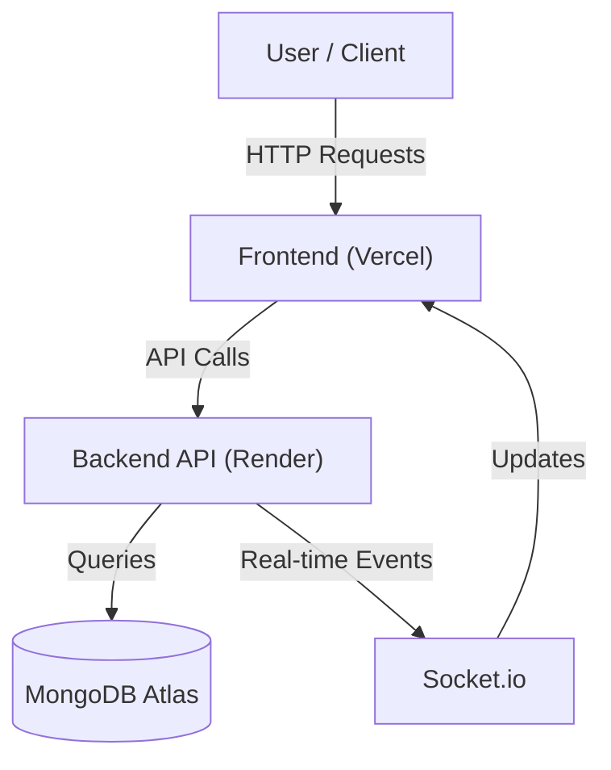

# 🚆 Bhopal Food Choice App


**Taste the Royal Legacy of Bhopal, delivered directly to your train seat.**

### 🚀 **Live Demo:** [Frontend App](https://bhopal-food.vercel.app) | [Backend API](https://bhopal-food-1.onrender.com)

---

## 🏗️ Architecture Flow



## 📖 About
**Bhopal Food Choice** is a full-stack MERN application designed to solve the problem of ordering hygienic, premium food while traveling by train. It features a modern, luxury-themed UI, real-time order tracking, and a unique "Group Ordering" feature for families and large groups.

## ✨ Key Features
- **👑 Premium UI/UX**: A modern, glassmorphism-inspired design with smooth animations.
- **🚆 Train Seat Delivery**: Users can specify PNR and Seat Number for precise delivery.
- **👨‍👩‍👧‍👦 Group Ordering**: Real-time collaborative cart for families (powered by Socket.io).
- **📦 Order Tracking**: Live status updates for your food order.
- **🛡️ Admin Dashboard**: Complete management system for orders and menu items.
- **📱 Mobile First**: Fully responsive design for all devices.

## 🛠️ Tech Stack
- **Frontend**: React.js, Tailwind CSS, Framer Motion, Vite.
- **Backend**: Node.js, Express.js, Socket.io.
- **Database**: MongoDB Atlas (Cloud).
- **Deployment**: Vercel (Frontend) + Render (Backend).

---

## ⚙️ Local Installation

If you want to run this project locally:

1. **Clone the repository**
   ```bash
   git clone https://github.com/25Rohit25/Bhopal-Food.git
   ```

2. **Install Dependencies**
   ```bash
   # Install Server Deps
   cd server
   npm install

   # Install Client Deps
   cd ../client
   npm install
   ```

3. **Environment Variables**
   Create a `.env` file in the `server` folder:
   ```env
   PORT=5000
   MONGO_URI=your_mongodb_connection_string
   JWT_SECRET=your_secret_key
   NODE_ENV=development
   ```

4. **Run the Project**
   ```bash
   # Terminal 1 (Backend)
   cd server
   npm run dev

   # Terminal 2 (Frontend)
   cd client
   npm run dev
   ```

## 🔑 Admin Credentials (Demo)
- **Email**: `admin@example.com`
- **Password**: `password123`

---

## 📄 License
This project is licensed under the [MIT License](LICENSE).
